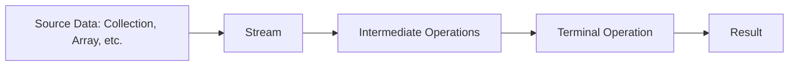
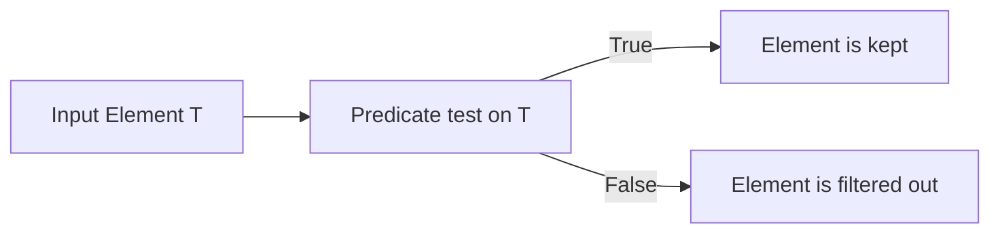
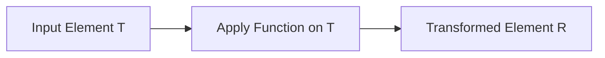
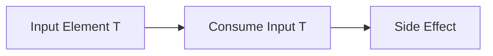
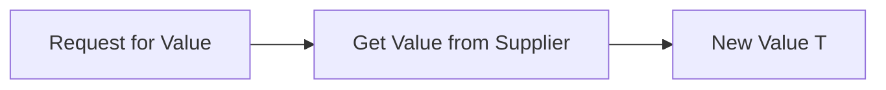
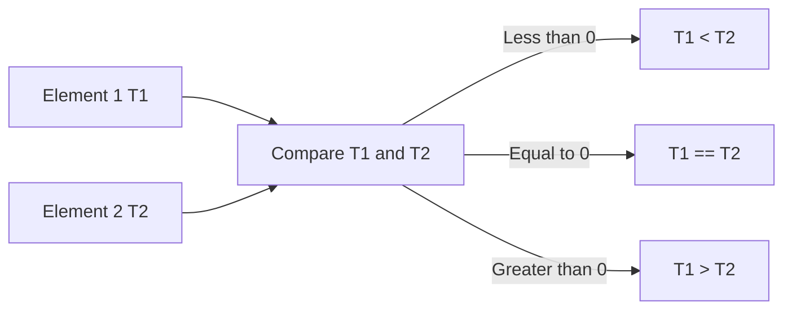

# Java 8 Streams API: A Comprehensive Guide

The Java 8 Streams API revolutionized how we process collections of data. It introduced a functional programming style to Java, allowing for more concise, readable, and parallelizable code. This document provides an in-depth exploration of the core concepts and functionalities of the Streams API, complete with examples and explanations.

## Overview

The Streams API provides a way to process collections of data in a declarative manner. Instead of explicitly iterating over elements, you define a pipeline of operations that are applied to the data. This approach offers several advantages:

-   **Conciseness:** Less code is needed to express complex operations.
-   **Readability:** Code becomes more expressive and easier to understand.
-   **Parallelism:** Streams can be easily parallelized to take advantage of multi-core processors.
-   **Immutability:** Streams operations do not modify the original collection.

## Key Concepts

### 1. Streams

A stream is a sequence of elements that supports various aggregate operations. It's not a data structure that stores elements but rather a pipeline that processes data from a source.



### 2. Source

The source of a stream is where the elements come from. Common sources include:

-   **Collections:** `List`, `Set`, `Map` (values or keys)
-   **Arrays:** `Arrays.stream()`
-   **I/O Channels:** Reading from a file
-   **Generators:** `Stream.generate()`
-   **Static Factories:** `Stream.of()`

### 3. Intermediate Operations

Intermediate operations are transformations applied to a stream that return a new stream. They are lazy, meaning they are not executed until a terminal operation is called. Examples include:

-   `filter()`:  Selects elements based on a `Predicate`.
-   `map()`: Transforms each element using a `Function`.
-   `sorted()`: Sorts the elements.
-   `distinct()`: Removes duplicate elements.
-   `limit()`: Reduces the number of elements in the stream.
-   `skip()`: Skips a specified number of elements.
-   `peek()`: Perform an action on each element as they are consumed from the stream (useful for debugging)

### 4. Terminal Operations

Terminal operations produce a result or a side effect. They are eager and initiate the processing of the stream. Examples include:

-   `forEach()`: Performs an action for each element.
-   `collect()`: Accumulates elements into a collection.
-   `reduce()`: Reduces elements into a single value.
-   `count()`: Returns the number of elements.
-   `anyMatch()`, `allMatch()`, `noneMatch()`: Checks if any/all/none of the elements match a predicate.
-   `findFirst()`, `findAny()`: Returns the first/any element matching a criteria       
-   `min()`, `max()`: Returns the minimum/maximum element according to a `Comparator`.  

## Functional Interfaces

Streams heavily rely on functional interfaces, which are interfaces with a single abstract method. These interfaces are used to define lambda expressions and method references.

### 1. `Predicate<T>`

Represents a boolean-valued function of one argument. Used in `filter()` to select elements based on a condition.



```java
import java.util.function.Predicate;

Predicate<Integer> isEven = n -> n % 2 == 0;
boolean result = isEven.test(4);  // true
```

### 2. `Function<T, R>`

Represents a function that accepts one argument and produces a result. Used in `map()` to transform elements.



```java
import java.util.function.Function;

Function<String, Integer> stringLength = str -> str.length();
int length = stringLength.apply("hello"); // 5
```

### 3. `Consumer<T>`

Represents an operation that accepts a single input argument and returns no result. Used in `forEach()` to perform actions on elements.



```java
import java.util.function.Consumer;

Consumer<String> printString = str -> System.out.println(str);
printString.accept("Hello world!"); // Prints Hello world!
```

### 4. `Supplier<T>`

Represents a supplier of results.



```java
import java.util.function.Supplier;

Supplier<Double> randomDouble = () -> Math.random();
double value = randomDouble.get(); // Generates a random double.
```

### 5. `Comparator<T>`

Represents a comparison function, used for sorting.



```java
import java.util.Comparator;

Comparator<String> stringComparator = (s1, s2) -> s1.compareTo(s2);

//using method reference
Comparator<String> stringComparator2 = String::compareTo;
```

### 6. `Comparable<T>`

Interface to implement natural ordering for a class.

```java
class Person implements Comparable<Person> {
    private String name;
    private int age;

    public Person(String name, int age) {
        this.name = name;
        this.age = age;
    }

    @Override
    public int compareTo(Person other) {
        return Integer.compare(this.age, other.age); // Sort by age
    }

    @Override
    public String toString(){
      return "name: "+name + " age: "+ age;
    }
    //getter for age and name
     public int getAge(){
       return age;
     }

      public String getName(){
       return name;
     }
}

// In main method:
List<Person> people = List.of(new Person("Alice", 30), new Person("Bob", 20), new Person("Charlie", 25));
people.sort(null);//natural ordering

people.forEach(p-> System.out.println(p));

//you can sort using comparator in the sort method
people.sort(Comparator.comparing(Person::getName));
people.forEach(p-> System.out.println(p));
```

## Lambda Expressions

Lambda expressions provide a concise way to define anonymous functions. They use the following syntax:

```java
(parameters) -> expression
(parameters) -> { statements; }
```

Examples:

```java
// Lambda expression to calculate square of an integer
Function<Integer, Integer> square = x -> x * x;

// Lambda expression to check if a string is empty
Predicate<String> isEmpty = str -> str.isEmpty();

// Lambda expression to print a greeting
Consumer<String> greet = name -> System.out.println("Hello, " + name + "!");
```

## Code Examples

### Filtering and Mapping

```java
import java.util.Arrays;
import java.util.List;
import java.util.stream.Collectors;

public class StreamExamples {
    public static void main(String[] args) {
        List<Integer> numbers = Arrays.asList(1, 2, 3, 4, 5, 6);

        // Filter even numbers and map them to their squares
        List<Integer> squaresOfEvens = numbers.stream()
                .filter(n -> n % 2 == 0)
                .map(n -> n * n)
                .collect(Collectors.toList());

        System.out.println(squaresOfEvens); // Output: [4, 16, 36]
    }
}
```

### Sorting

```java
import java.util.Arrays;
import java.util.List;
import java.util.stream.Collectors;

public class StreamExamples {
    public static void main(String[] args) {
      List<String> names = Arrays.asList("Charlie", "Alice", "Bob");

      List<String> sortedNames = names.stream()
            .sorted() //Natural ordering for String
            .collect(Collectors.toList());

      System.out.println(sortedNames); // Output: [Alice, Bob, Charlie]

       List<String> sortedNamesReverse = names.stream()
            .sorted(Comparator.reverseOrder())
            .collect(Collectors.toList());
        System.out.println(sortedNamesReverse);// Output: [Charlie, Bob, Alice]
    }
}
```

### Reduction

```java
import java.util.Arrays;
import java.util.List;
import java.util.Optional;

public class StreamExamples {
    public static void main(String[] args) {
        List<Integer> numbers = Arrays.asList(1, 2, 3, 4, 5);

        // Calculate the sum of numbers
        int sum = numbers.stream()
                         .reduce(0, Integer::sum);
        System.out.println(sum); // Output: 15

        // Find the maximum number
        Optional<Integer> max = numbers.stream()
                .reduce(Integer::max);
        max.ifPresent(m-> System.out.println(m)); // Output: 5

      }
}
```

### Parallel Streams

Streams can be easily parallelized to improve performance on large datasets.

```java
import java.util.Arrays;
import java.util.List;

public class StreamExamples {
    public static void main(String[] args) {
        List<Integer> numbers = Arrays.asList(1, 2, 3, 4, 5, 6, 7, 8, 9, 10);

        long count = numbers.parallelStream()
                  .filter(x-> x%2==0)
                  .count();

         System.out.println(count); // Output 5
    }
}

```

### Collecting Data

```java
import java.util.Arrays;
import java.util.List;
import java.util.Map;
import java.util.Set;
import java.util.stream.Collectors;

public class StreamExamples {
  public static void main(String[] args) {
         List<String> names = Arrays.asList("Alice", "Bob", "Charlie", "Alice", "Bob"); 

        // Collect into a List
        List<String> uniqueNamesList = names.stream()
                                                .distinct()
                                               .collect(Collectors.toList());
        System.out.println(uniqueNamesList); //Output: [Alice, Bob, Charlie]

        // Collect into a Set
        Set<String> uniqueNamesSet = names.stream()
                                              .distinct()
                                               .collect(Collectors.toSet());
        System.out.println(uniqueNamesSet); //Output: [Alice, Bob, Charlie]

       // Collect into a Map
        Map<String, Integer> nameLengths = names.stream()
                .distinct()
                .collect(Collectors.toMap(name -> name, String::length));
          System.out.println(nameLengths); //Output: {Bob=3, Alice=5, Charlie=7}        
  }
}
```

## Conclusion

The Java 8 Streams API provides a powerful and versatile way to process collections of data. By adopting a functional programming style, you can write more concise, readable, and efficient code. Understanding the concepts of streams, intermediate and terminal operations, functional interfaces, and lambda expressions is crucial to mastering this API. With this guide, you're now equipped to begin leveraging the full potential of the Streams API in your Java projects.